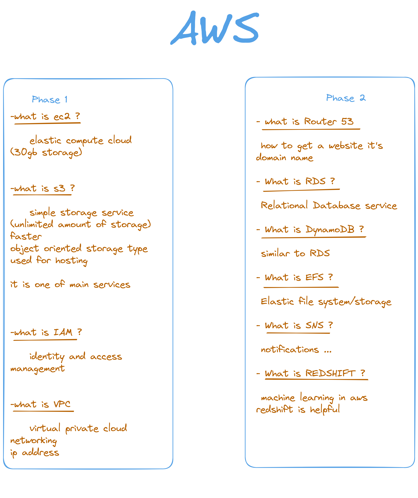

# AWS

## Topics

- #### EC2
- #### S3
- #### IAM
- #### VPC
- #### Router 53
- #### RDS
- #### DynamoDB
- #### EFS
- #### SNS
- #### REDSHIFT

## What is AWS ?

#### Amazon web services

#### Amazon web services is a subsidiary of Amazon.com that provides on demand cloud computing platforms to individuals, companies and governments, on a paid subscription basis with a free-tier option available for 12 months.

## What is Cloud ?

#### "The cloud" refers to servers that are accessed over the Internet, and the software and databases that run on those servers. Cloud servers are located in data centers all over the world. By using cloud computing, users and companies do not have to manage physical servers themselves or run software applications on their own machines.

## What is Cloud Computing ?

#### Simply put, cloud computing is the delivery of computing services-including servers, storage, databases, networking, software, analytics, and intelligence-over the Internet ("the cloud") to offer faster innovation, flexible resources, and economies of scale. You typically pay only for cloud services you use, helping lower your operating costs, run your infrastructure more efficiently and scale as your business needs change.
